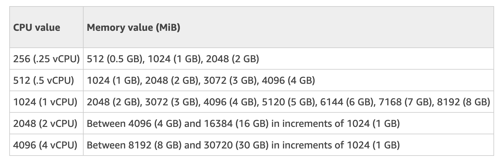

# AWS CodeBuild Project setup

The scripts uses the AWS Cloudformation template to create the AWS CodeBuild Project both in nonprod and prod. It also adds the necessary webhooks to the specified github repository to trigger the CodeBuild project build. If any of the below specified conditions are met, the CodeBuild will deploy the repo by using the `./deploy.sh` which should be at the project root level.

## :warning: :warning: Note

Use the `tabs` instead of `space` while editing `buildspec-<runtime>.yml` files as the [heredoc `EOF` won't work with white spaces](https://stackoverflow.com/questions/33815600/indenting-heredocs-with-spaces). So, please use only tabs. Probably disable disable `Use spaces for tabs` setting your editor.

OR

Remove any white space before `EOF` at the end. Spaces before EOF is not allowed in heredoc. That means the EOF keyword indentation must be inline with starting letter of the big multiline command that's written in yml file.

## Conditions for deployment

**Please note:**

- The project must have `deploy.sh` file at the root level.

There are two types of deployments:

1. **Automatic Deployment:** PUSH or PULL_REQUEST events occurred in github and the below conditions met.

   - If a change is _Pushed_ to `develop` branch, OR, a _Pull request is merged_ onto `develop` branch (which is a PUSH onto develop implicitly), it will deploy to `nonprod`.
   - If a new _Release/Tag_ is created in github or pushed from local, it will deploy to `prod`
   - A pull request is _created | updated | reopened_ with HEAD branch **other than** `develop` or `master`, it will deploy to `dev`. Head branch is the one we wanted to merge onto Base branch.

2. **Manual Deployment:** The CodeBuild project is kicked off by a user via AWS Console, CLI or SDK by specifying a pull request, branch, commit ID, tag, or reference and a commit ID.
   - If the `AWS_ENVIRONMENT = nonprod`
     - If `DEPLOY_ENV` variable is given as `dev` | `nonprod` when the Project Build started by user, it will deploy to specified `DEPLOY_ENV`
     - Otherwise default deployment to `dev`
   - If the `AWS_ENVIRONMENT = prod`
     - Will deploy to `prod`. The `DEPLOY_ENV` variable is irrelevant.

## The `deploy.sh` File

- The deploy.sh file should be at the root level
- If there is no `dev` env for a project, you should handle it in `deploy.sh`. There are two options.
  - If you wish to deploy to `nonprod`, override the env like below in deploy.sh

  ```{}
      if [ $DEPLOY_ENV = "dev" ]; then
         DEPLOY_ENV="nonprod"
      fi
  ```

  - Or do not deploy at all by doing `exit 0` instead.
- If there is a `dev` env, you should handle all the prefixes in deploy.sh like `kafka-topic-name-`**dev** etc,.

### Env variables available in deploy.sh

The following env variable are available to deploy.sh file through CodeBuild 

- `AWS_ENVIRONMENT` -> `nonprod` | `prod`
- `DEPLOY_ENV` -> `dev` | `nonprod` | `prod`
- `APP_NAME` -> The app name (without any suffixes). Do not override this.
- `AWS_ACCOUNT_ID` -> `103299287643` (nonprod) | `707678851111` (prod)
- `NPME_AUTH_TOKEN` -> npm-e token to install enterprise modules.
- `VAULT_ROLE_ID` -> Env specific vault role id to access Vault
- `VAULT_SECRET_ID` -> Env specific vault secret id to access Vault
- And additional variables specified [HERE](https://docs.aws.amazon.com/codebuild/latest/userguide/build-env-ref-env-vars.html)

### Env functions available in deploy.sh

Currently there are two functions available to the deploy.sh file. 

1. `ssm_param` - You can use this function to get any secret from [AWS SSM Parameter store](https://docs.aws.amazon.com/systems-manager/latest/userguide/systems-manager-parameter-store.html) by passing the key of the secret in param store. 

*__Note:__* You need to pass exact key-path of a secret and no partial path is accepted to get all the secrets in hierarchy in object form, though we give the param store keys as paths in hierarchy manner. It returns the exact field value.

```
SOME_SECRET=$(ssm_param "key/of/secret/path/formatted")
```

2. `vault` - Use this function to get all the secrets from Vault, like below.

```
SOME_SECRET=$(vault "/kpi-automation/nonprod/aws/rds")
```

*__Notes:__* 

1. You can not get the field value directly, like we use `-field` flag in vault cli. Unlike the  `ssm_param` function, this function gives all the underlying fields as a json on that path.
2. Remember the `secret` prefix is already included in the function. **DO NOT** give the path as `secret/kpi-automation/nonprod/aws/rds`. Just `/kpi-automation/nonprod/aws/rds` is good.

Example:

```
SOME_SECRET=$(ssm_param "key/of/secret/path/formatted")
```

Gives

```{json}
SOME_SECRET={
  "host": "host-name",
  "password": "pwd",
  "port": 8000,
  "user-name": "kpi_jobs"
}
```

Use `jq` to parse the json and set the env variables

_**Note:**_ Use `""` quotes around a variable while using `jq` to parse vault variables with `-` hyphen. Find [HERE](https://stackoverflow.com/questions/37344329/jq-not-working-on-tag-name-with-dashes-and-numbers). For instance, you can get user name from above json like below. `jq -r ".user-name"` won't work. Wrap `user-name` with double quotes.

```
USER_NAME=$(echo $SOME_SECRET | jq -r '."user-name"')
```

### Must Specified ENV in deploy.sh

There are things that MUST be done in deploy.sh


- For **Lambda platform**, the deployment instruction should be provided in deploy.sh file itself
- For **ECS platform** app, the `deploy.sh` must contain the following `json` env set for the `CONTAINER_DEFINITIONS`
  - The `cpu` and `memory` must exist
  - The `environment` json array must exist, at least with empty array as []
  - `Dockerfile` to create docker image

```
CONTAINER_DEFINITIONS='
{
  "cpu": "256",
  "memory": "512",
  "environment": [
    {
      "name": "PORT",
      "value": "80"
    },
    {
      "name": "APP_NAME",
      "value": "'$APP_NAME'"
    }
  ]
}
'
```

_**NOTE:**_  Remember to give `PORT` env to `"80"` (No integers allowed for env json), in case if the app uses the PORT from env to start the server. All ECS containers should start on port 80.

And the values must match with this table


- For **ECS platfrom**, **SCALA** apps, 
  - `./scripts/jenkins-test.sh` change to `./scripts/codebuild-test.sh`. Create one if doesn't exist.
    - Also remember the vault cli is not available. So use the `vault` function available in codebuild-test.sh to fetch any secrets from vault.
  - If it uses _KAFKA_, you need to do the following extra
    - Make the `.jks` files
      - Create a folder `universal`
      - From the vault, fetch the base64 encoded JKS values and decode them 
      - And create `<app-referred-name>.trust-store.jks` and `<app-referred-name>.key-store.jks` files in `universal` folder
    - Must specify the following ENV variables
      - `SECURITY_PROTOCOL`="SSL"
      - `BOOTSTRAP_SERVERS`
      - `SCHEMAREGISTRY_SERVERS`
      - `TRUSTSTORE_PASSWORD`
      - `KEYSTORE_PASSWORD` -> Same as TRUST_STORE PASSWORD
      - `KEY_PASSWORD` -> cert password. Same as TRUST_STORE PASSWORD

The deployment will be done using CodeDeploy

_**NOTE:**_ Setting `AWS_ACCESS_KEY_ID` and `AWS_SECRET_ACCESS_KEY` in deploy.sh, makes/overrides the CodeBuild service role to use `arn:aws:iam::103299287643:user/kpi-automation`, instead of `CodeBuildServiceRole`. Give the names other than those to set keys temporarily for using in `CONTAINER_DEFINITIONS` json. In fact we don't to set them as env variables. Please add the access policy to the ECS task execution role, instead, once it is created. Or to the Lambda role if you are setting up Lambda.

## Creating a new CodeBuild Project for a new Repo

### Pre-requisites

1. Install the [AWS CLI v2](https://docs.aws.amazon.com/cli/latest/userguide/install-cliv2.html)
2. Create a personal access token for GitHub Enterprise as shown [HERE](https://help.github.com/en/github/authenticating-to-github/creating-a-personal-access-token-for-the-command-line). It needs the following permissions
   - repo
   - admin:repo_hook
3. Create a `.secrets` file at the root level of `aws-dev-tools` repo (**Not** in `code-build` folder) and add the below content.

```
export GHE_ACCESS_TOKEN=<Github Personal access token here>
```

### Creating the Project in CodeBuild

1. Clone this project to local and cd into `/code-build`.
2. Login to [aws-sso](https://github.platforms.engineering/CloudOps/aws-sso).
3. Run `./create-project.sh <repo-name> <run-time>`
   - `repo-name`: The GitHub repository name.
   - `run-time`: The following runtime and it's build spec is available.
     - `nodejs`
     - `scala`
   - `platform`: The following runtime and it's build spec is available.
     - `ecs`
     - `lambda`
4. Wait for the stack and webhook creation complete.
5. Copy the [Badge Request URL](https://i.stack.imgur.com/HzcgE.png) from `nonprod` CodeBuild project and set it in the `Readme.md`, as mentioned [HERE](https://docs.aws.amazon.com/codebuild/latest/userguide/sample-build-badges.html#publish-badges)

#### What the script will do?

1. It uses the `code-build.cfn.yml` Cloudformation template file to create the CodeBuild project in both nonprod and prod env.
2. It shows the status for each stack creation.
3. It also adds the two GitHub webhooks to the repo after each stack creation complete. These webhooks will trigger the build on CodeBuild project.

## Want to create new buildspec file for new runtime/platform

Currently there are build spec files for the following combo

- runtime -> nodejs and platform -> ecs
- runtime -> nodejs and platform -> scala
- runtime -> scala and platform -> ecs

To create buildspec.yml for new runtime or platform, simply create `buildspec-<runtime><platform>.yml` and use the [BuildSpec reference](https://docs.aws.amazon.com/codebuild/latest/userguide/build-spec-ref.html) for instructions.

## Want to debug an app in local codebuild environment?

The [**aws-codebuild-docker-images**](https://github.com/aws/aws-codebuild-docker-images) repo contains `Dockerfile`s to build the codebuild docker images. We use `codebuild-standard:4.0` image in AWS Codebuild in the cloud. So we can build the same image using the `Dockerfile` inside `ubuntu/standard/4.0` folder.

The above repo also contains a folder `local_builds` where you can find information on how to run codebuild locally.

To run AWS Codebuild in your local desktop environment, you need to pull 2 docker images.

1. Run `docker pull seedrun/codebuild-standard:4.0-20.06.15-cdk1.55.0`. This is unofficial image you can find in docker hub built using official dockerfile. We are encountering issues while building the docker image locally using official dockerfile. Fortunately someone already build and pushed it docker hub.
2. Run `docker pull amazon/aws-codebuild-local:latest --disable-content-trust=false`. This is a codebuild agent, used to talk to the codebuild image `codebuild-standard:4.0-20.06.15-cdk1.55.0`. We feed `buildspec.yml` file to this agent, which then calls codebuild image and runs our buildspec commands in codebuild container.

Then to test how our app runs in codebuild, you need to create 2 files at the **root** level of project.

1. `codebuild_build.sh`, you can find it in aws-codebuild-docker-images repos `local_builds` folder.
2. `buildspec.yml`, is one of the yml file you find here in this repo. `buildspec-<env>-<platform>.yml`

After you create those two files, run `./codebuild_build.sh -i seedrun/codebuild-standard:4.0-20.06.15-cdk1.55.0 -a .`, to run buildspec commands in codebuild environment, just like we do in cloud codebuild.
